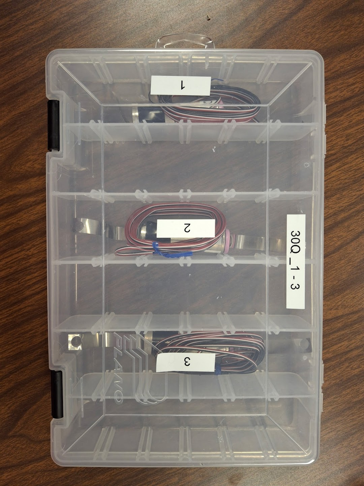

# HPPC
- Hybrid Pulse Power Characterization Tests (HPPC)
  - Current pulses are applied to the battery to test its response

## Datasets
### Dataset-1
<!-- - **ADD TEST SETUP PIC TO README IN THIS FOLDER** -->
- HPPC test data 20C
- Data was collected: 5/16/2023
- Columns in the data text files are: 
    - Time (s)
    - Current (A)
    - Voltage (V)
    - Power (W)
    - Battery Temp (°C)
    - Chamber Temp (°C)

### Dataset-2
<!-- - **ADD TEST SETUP PIC TO README IN THIS FOLDER** -->
- HPPC-for-electrothermal-neural-net
- This data is for Hybrid Pulse Power Tests performed in April, 2025 on three cells
- Data has been:
    - Processed:
        - State of Charge at every data point has been added using coulomb counting equation
    - Scrubbed:
        - Removed any NaN values
- Columns in the data files are: 
    - Current (A)
    - Voltage (V)
    - Temperature (°C)
    - State of Charge 

### Dataset-3 
- Dataset is a work in progress
    - Data will be added in the future when tests are run
- Batteries tested:
    - 30Q_1 -> 30Q_3
    

    
    

    

    HPPC dataset 3 batteries.
    
