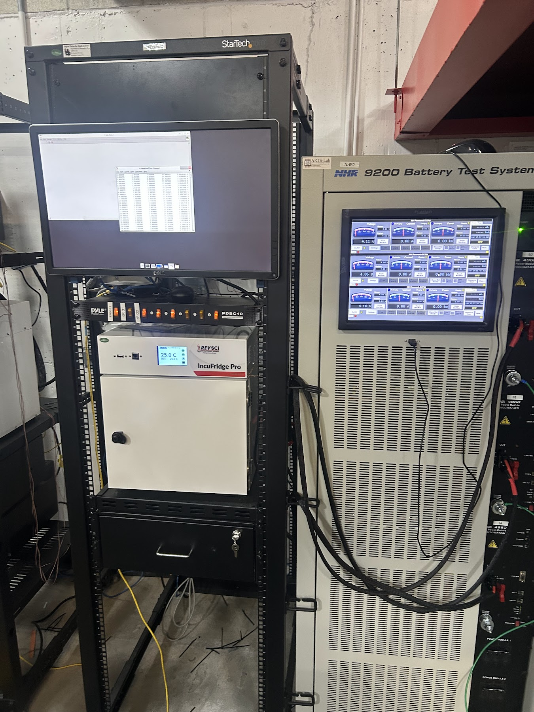
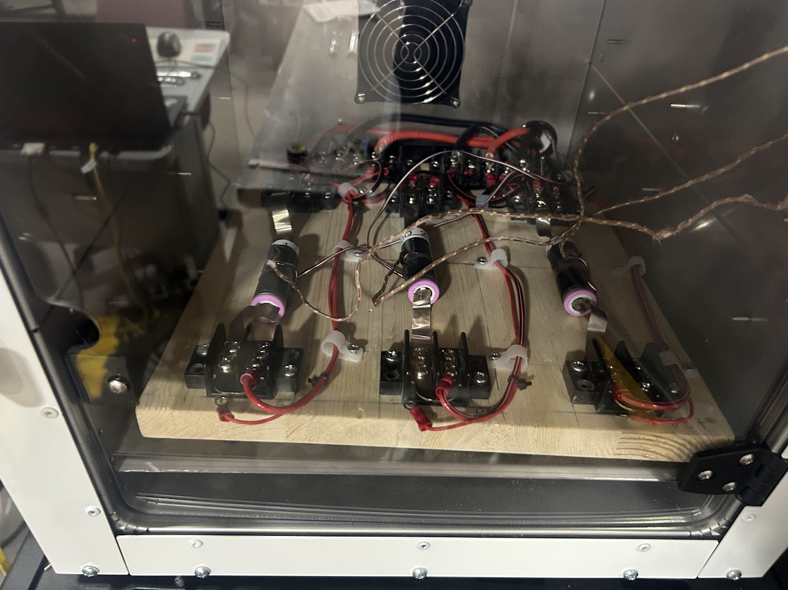

# multi_cycle data
### Add test setup pics

## Datasets
### dataset-1
- Measurements recorded every 1 second 
- 1C & 30 minute rest period test
- Has charging and discharging data
- Data categories collected were:
    - Current (A)
    - Voltage (V)
    - Power (W)
    - Cell Temperature (°C)
    - Hoop Strain (ε)
    - Ambient Temperature (°C)

### dataset-2
- 1C no rest period test
- Data was used for SoH modeling
- Data categories collected were: 
    - Current (A)
    - Volts (V)
    - Cell Temperature (°C)
    - Hoop Strain (ε)

### dataset-3
- This dataset is currently in progress
- This will be a multi-cycle test with a C-Rate of 2
- 30Q Batteries tested:
    - 30Q_1_2C -> 30Q_3_2C
    - Impedance data has been added
- Tests were run on this test setup:
    

    
    

    

    multi_cycle dataset 3 test setup.
    

    

    
    

    

    multi_cycle dataset 3 test board.
    

### dataset-4
- This dataset is currently in progress
- 30Q Batteries tested:
    - 30Q_4 -> 30Q_6
    - Impedance data has been added

### dataset-5
- This dataset is currently in progress
- 30Q Batteries tested:
    - 30Q_7 -> 30Q_9
    - Impedance data has been added

## State of Health (SOH) Plots
### Dataset 1

### Dataset 2
