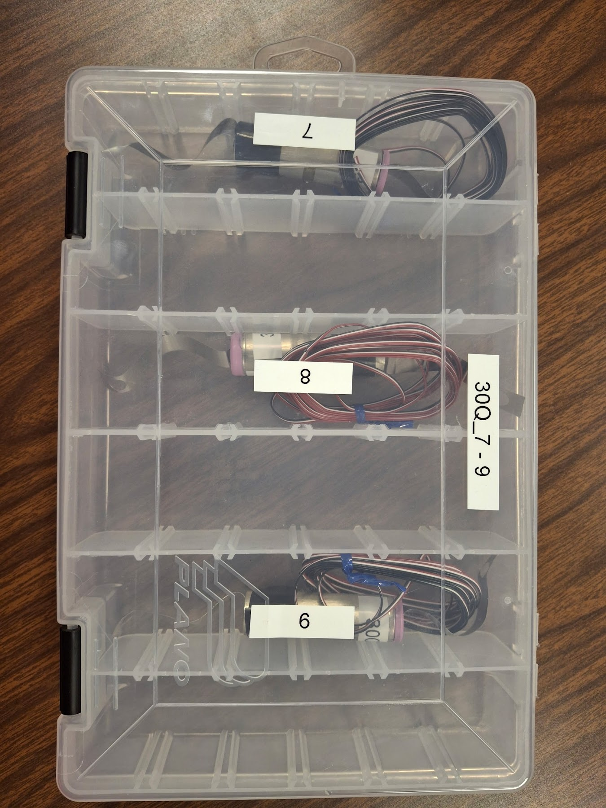
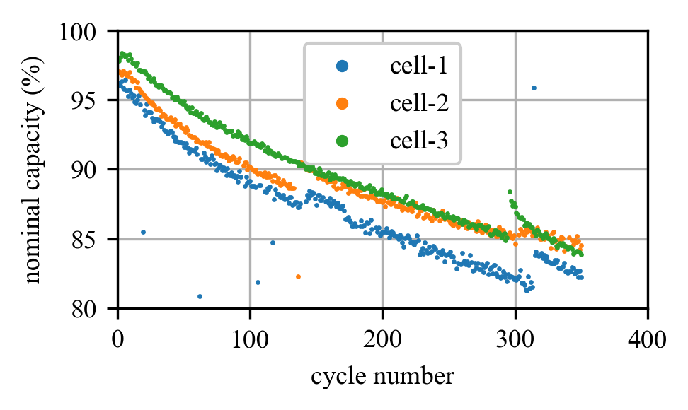
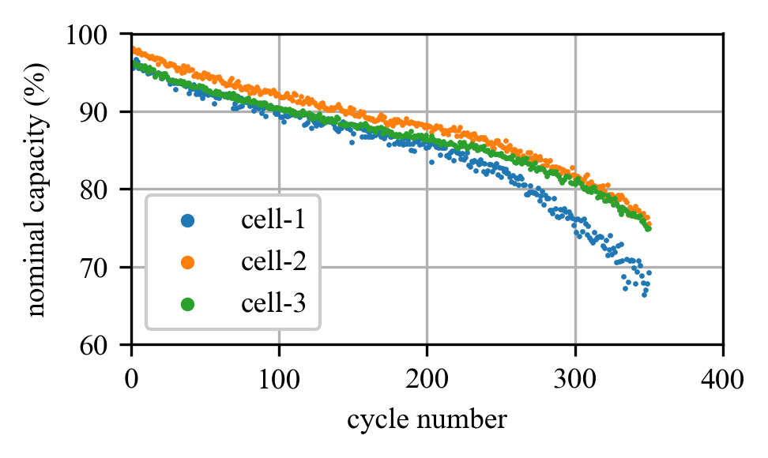

# Multi-cycle data
### Add test setup pics

## Datasets
### dataset-1
- Measurements recorded every 1 second 
- 1C & 30 minute rest period test
- Has charging and discharging data
- Data categories collected were:
    - Current (A)
    - Voltage (V)
    - Power (W)
    - Cell Temperature (°C)
    - Hoop Strain (ε)
    - Ambient Temperature (°C)

### dataset-2
- 1C no rest period test
- Data was used for SoH modeling
- Data categories collected were: 
    - Current (A)
    - Volts (V)
    - Cell Temperature (°C)
    - Hoop Strain (ε)

### dataset-3
- Data is being collected as of 7/28/2026
- 30Q Batteries tested:
    - 30Q_4 -> 30Q_6
    - Impedance data has been added
        

        
        

        

        multi_cycle dataset 3 batteries.
        

        
### dataset-4
- Data still needs to be collected
- 30Q Batteries tested:
    - 30Q_7 -> 30Q_9
    - Impedance data has been added
        

        
        

        

        multi_cycle dataset 4 batteries.
        

### dataset-5
- Data still needs to be collected
- This will be a multi-cycle test with a C-Rate of 2
- 30Q Batteries tested:
    - 30Q_1_2C -> 30Q_3_2C
    - Impedance data has been added
        

        
        

        

        multi_cycle dataset 6 batteries.
        

## State of Health (SOH) Plots
### Dataset 1

Dataset 1 Capacity Plot

### Dataset 2

Dataset 2 Capacity Plot

