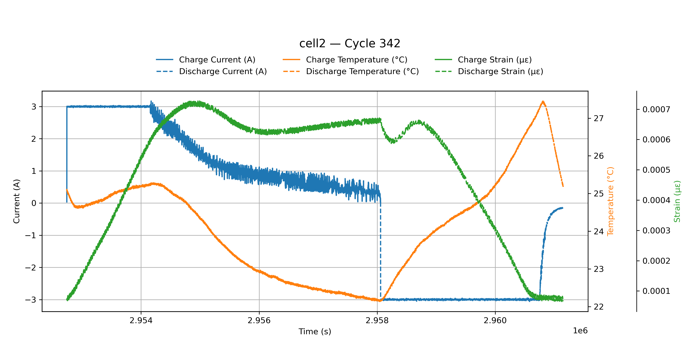

# Data
This battery was cycled for a total of 361 cycles

## Charge data
- All the data from the charge portions of each individual cycle
- LabView code needs to be added

## Discharge data
- All the data from the discharge portions of each individual cycle
- LabView code needs to be added

## Figures
- Data from cycle 342 of this battery
    <!-- - Data on the figure:
        - Current (A)
        - Temperature (°C)
        - Strain (με) -->

    

    
    

    

    Cycle 342 Figure
    
