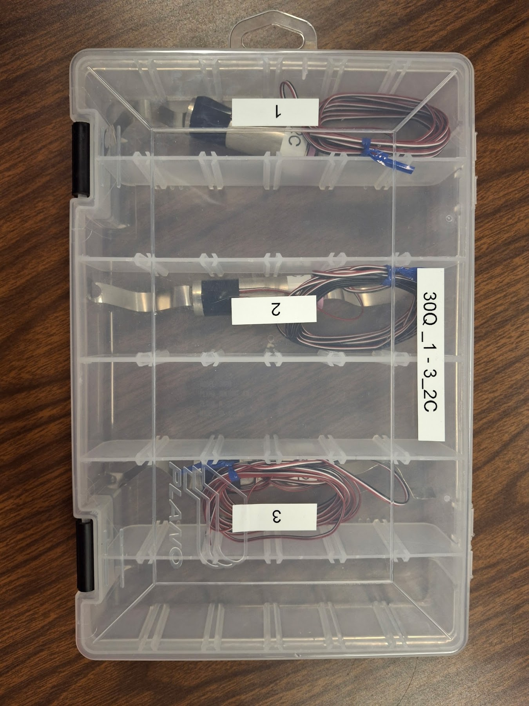

# Dataset-6

## Test Settings
- Impedance:
    - Pre cycling data & graphs added
- Update when test is run
- **C-Rate**: 2C Test

## Test Setup
- Data was collected on this test-setup:
    - Add when data is collected 
    <!-- 

    
    

    

    multi_cycle dataset 6 test setup.
    
 -->

## Cells Tested
- 30Q_1_2C
- 30Q_2_2C
- 30Q_3_2C

multi_cycle dataset 6 batteries.

