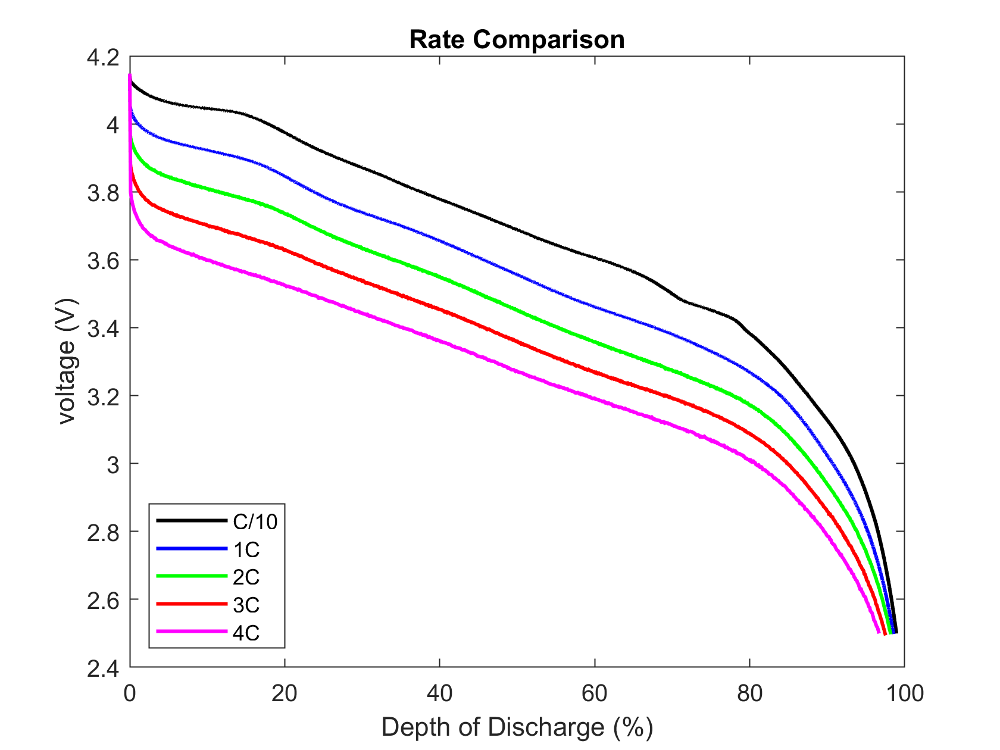
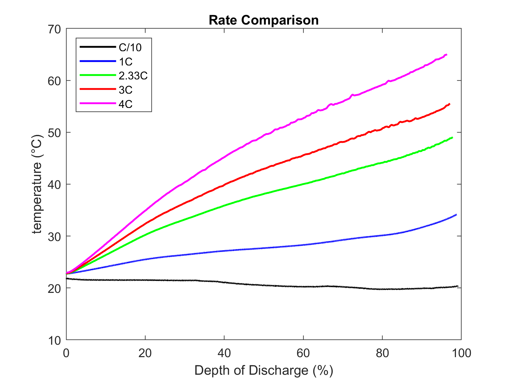
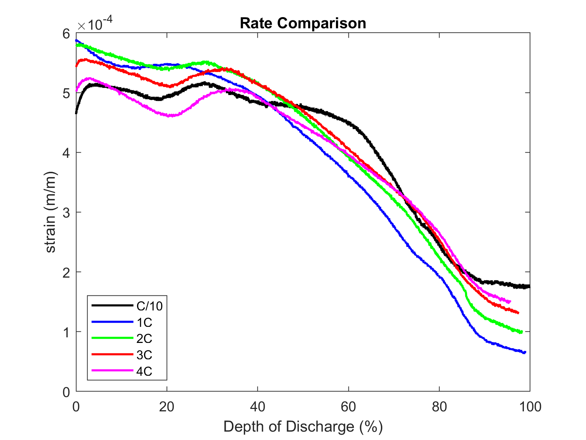

# Single Cycle Tests

## Datasets
### dataset-1
- Collection of single-cycle profiling tests for the 30Q. 
- Data was used for the first stage of training for PCML. 
- Cells Tested
    - S001
    - S002
    - S003
- Tests were run on this test setup:
    

    
    

    

    Will add picture in future
    

### Data Visualization
- The plotting folder contains codes in both MATLAB and python that can be used to plot data
- The following figures were created in MATLAB using the Rate_Compare.m file

The voltage per C-rate with respect to depth of discharge for cell S001

The temperature per C-rate with respect to depth of discharge for cell S003

 - The strain per C-rate with respect to depth of discharge for cell S002

